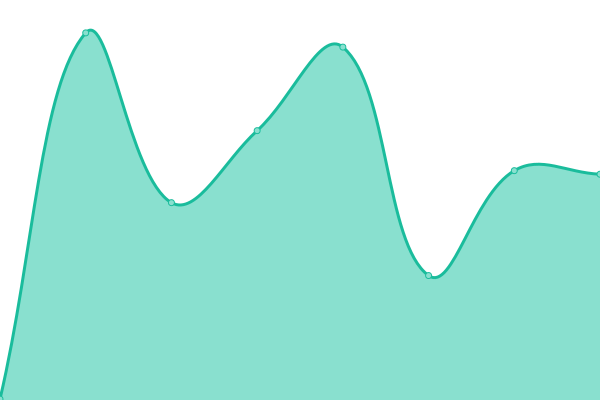

# [📈 Live Status](https://status.woomy.ovh): <!--live status--> **🟩 All systems operational**

This repository contains the open-source uptime monitor and status page for [Woomy](https://woomy.ovh), powered by [Upptime](https://github.com/upptime/upptime).

With [Upptime](https://upptime.js.org), you can get your own unlimited and free uptime monitor and status page, powered entirely by a GitHub repository. We use [Issues](https://github.com/woomymy/status/issues) as incident reports, [Actions](https://github.com/woomymy/status/actions) as uptime monitors, and [Pages](https://status.woomy.ovh) for the status page.

<!--start: status pages-->
<!-- This summary is generated by Upptime (https://github.com/upptime/upptime) -->
<!-- Do not edit this manually, your changes will be overwritten -->
<!-- prettier-ignore -->
| URL | Status | History | Response Time | Uptime |
| --- | ------ | ------- | ------------- | ------ |
|  [Personnal website](https://woomy.be) | 🟩 Up | [personnal-website.yml](https://github.com/Woomymy/status/commits/HEAD/history/personnal-website.yml) | 

 735ms
     
 | 

<a href="https://status.woomy.be/history/personnal-website">100.00%</a>
    

|  [Blog](https://blog.woomy.be) | 🟩 Up | [blog.yml](https://github.com/Woomymy/status/commits/HEAD/history/blog.yml) | 

 342ms
     
 | 

<a href="https://status.woomy.be/history/blog">100.00%</a>
    

|  [Files storage](https://files.woomy.be) | 🟩 Up | [files-storage.yml](https://github.com/Woomymy/status/commits/HEAD/history/files-storage.yml) | 

 862ms
     
 | 

<a href="https://status.woomy.be/history/files-storage">100.00%</a>
    

|  [Bitwarden](https://bitwarden.woomy.be) | 🟩 Up | [bitwarden.yml](https://github.com/Woomymy/status/commits/HEAD/history/bitwarden.yml) | 

 780ms
     
 | 

<a href="https://status.woomy.be/history/bitwarden">100.00%</a>
    

|  [NextCloud](https://nextcloud.woomy.be) | 🟩 Up | [next-cloud.yml](https://github.com/Woomymy/status/commits/HEAD/history/next-cloud.yml) | 

 3610ms
     
 | 

<a href="https://status.woomy.be/history/next-cloud">100.00%</a>
    

|  [Start page](https://start.woomy.be) | 🟩 Up | [start-page.yml](https://github.com/Woomymy/status/commits/HEAD/history/start-page.yml) | 

 345ms
     
 | 

<a href="https://status.woomy.be/history/start-page">100.00%</a>
    

<!--end: status pages-->

[**Visit our status website →**](https://status.woomy.ovh)

## 📄 License

- Powered by: [Upptime](https://github.com/upptime/upptime)
- Code: [MIT](./LICENSE) © [Woomy](https://woomy.ovh)
- Data in the `./history` directory: [Open Database License](https://opendatacommons.org/licenses/odbl/1-0/)
