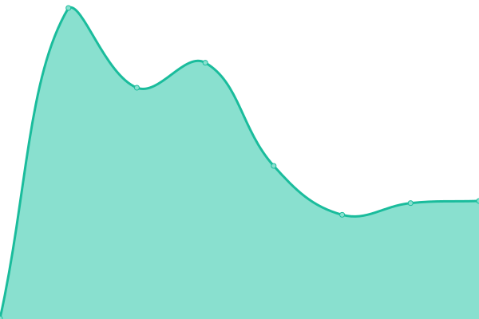

# [📈 Live Status](https://status.woomy.ovh): <!--live status--> **🟩 All systems operational**

This repository contains the open-source uptime monitor and status page for [Woomy](https://woomy.ovh), powered by [Upptime](https://github.com/upptime/upptime).

With [Upptime](https://upptime.js.org), you can get your own unlimited and free uptime monitor and status page, powered entirely by a GitHub repository. We use [Issues](https://github.com/woomymy/status/issues) as incident reports, [Actions](https://github.com/woomymy/status/actions) as uptime monitors, and [Pages](https://status.woomy.ovh) for the status page.

<!--start: status pages-->
<!-- This summary is generated by Upptime (https://github.com/upptime/upptime) -->
<!-- Do not edit this manually, your changes will be overwritten -->
<!-- prettier-ignore -->
| URL | Status | History | Response Time | Uptime |
| --- | ------ | ------- | ------------- | ------ |
|  [Personnal website](https://woomy.ovh) | 🟩 Up | [personnal-website.yml](https://github.com/Woomymy/status/commits/HEAD/history/personnal-website.yml) | 

 337ms
     
 | 

<a href="https://status.woomy.ovh/history/personnal-website">99.63%</a>
    

|  [Blog](https://blog.woomy.ovh) | 🟩 Up | [blog.yml](https://github.com/Woomymy/status/commits/HEAD/history/blog.yml) | 

 304ms
     
 | 

<a href="https://status.woomy.ovh/history/blog">99.63%</a>
    

|  [Files storage](https://files.woomy.ovh) | 🟩 Up | [files-storage.yml](https://github.com/Woomymy/status/commits/HEAD/history/files-storage.yml) | 

 1014ms
     
 | 

<a href="https://status.woomy.ovh/history/files-storage">100.00%</a>
    

|  [Gitea](https://gitea.woomy.ovh) | 🟩 Up | [gitea.yml](https://github.com/Woomymy/status/commits/HEAD/history/gitea.yml) | 

 910ms
     
 | 

<a href="https://status.woomy.ovh/history/gitea">100.00%</a>
    

|  [Bitwarden](https://bitwarden.woomy.ovh) | 🟩 Up | [bitwarden.yml](https://github.com/Woomymy/status/commits/HEAD/history/bitwarden.yml) | 

 822ms
     
 | 

<a href="https://status.woomy.ovh/history/bitwarden">100.00%</a>
    

|  [NextCloud](https://nextcloud.woomy.ovh) | 🟩 Up | [next-cloud.yml](https://github.com/Woomymy/status/commits/HEAD/history/next-cloud.yml) | 

 2245ms
     
 | 

<a href="https://status.woomy.ovh/history/next-cloud">100.00%</a>
    

|  [FreshRSS](https://rss.woomy.ovh) | 🟩 Up | [fresh-rss.yml](https://github.com/Woomymy/status/commits/HEAD/history/fresh-rss.yml) | 

 620ms
     
 | 

<a href="https://status.woomy.ovh/history/fresh-rss">100.00%</a>
    

|  [Debian repository](https://apt.woomy.ovh) | 🟩 Up | [debian-repository.yml](https://github.com/Woomymy/status/commits/HEAD/history/debian-repository.yml) | 

 615ms
     
 | 

<a href="https://status.woomy.ovh/history/debian-repository">100.00%</a>
    

|  [GSI2Zip](https://gsi2zip.woomy.ovh) | 🟩 Up | [gsi-2-zip.yml](https://github.com/Woomymy/status/commits/HEAD/history/gsi-2-zip.yml) | 

 573ms
     
 | 

<a href="https://status.woomy.ovh/history/gsi-2-zip">100.00%</a>
    

|  [Start page](https://start.woomy.ovh) | 🟩 Up | [start-page.yml](https://github.com/Woomymy/status/commits/HEAD/history/start-page.yml) | 

 234ms
     
 | 

<a href="https://status.woomy.ovh/history/start-page">99.63%</a>
    

|  [Joplin server](https://joplin.woomy.ovh) | 🟩 Up | [joplin-server.yml](https://github.com/Woomymy/status/commits/HEAD/history/joplin-server.yml) | 

 730ms
     
 | 

<a href="https://status.woomy.ovh/history/joplin-server">100.00%</a>
    

<!--end: status pages-->

[**Visit our status website →**](https://status.woomy.ovh)

## 📄 License

- Powered by: [Upptime](https://github.com/upptime/upptime)
- Code: [MIT](./LICENSE) © [Woomy](https://woomy.ovh)
- Data in the `./history` directory: [Open Database License](https://opendatacommons.org/licenses/odbl/1-0/)
